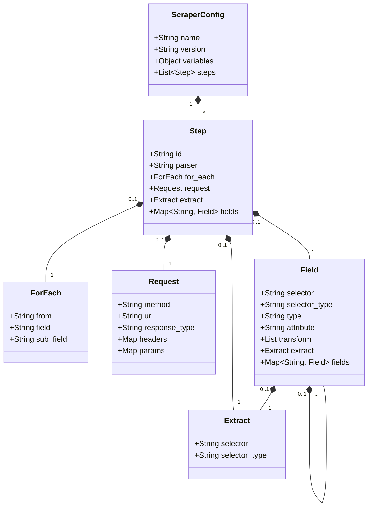

# Configuration Structure

## Top-Level JSON Schema

Every scraper configuration is represented as a JSON object containing global metadata, global variables, and an ordered array of workflow `steps`.

### Configuration Architecture Diagram



### Schema Overview

| Key | Type | Required | Description |
| --- | --- | --- | --- |
| `name` | string | **Yes** | A unique name or identifier for the scraper configuration. |
| `version` | string | No | Optional version string (e.g. `"1.0"`). |
| `variables` | object | No | Global key-value template variables. |
| `steps` | array | **Yes** | Sequential execution steps. See [Workflows & Loops](workflows-and-loops.md). |

---

## Complete JSON Configuration Example

```json
{
  "name": "e_commerce_catalog_scraper",
  "version": "1.0",
  "variables": {
    "base_url": "https://example.com",
    "user_agent": "Jexflow-Scraper/1.0"
  },
  "steps": [
    {
      "id": "category_products",
      "request": {
        "method": "GET",
        "url": "{{base_url}}/category/books",
        "headers": {
          "User-Agent": "{{user_agent}}"
        }
      },
      "extract": {
        "selector": ".product-card",
        "selector_type": "css"
      },
      "fields": {
        "product_id": {
          "selector": "a.product-link",
          "attribute": "data-id",
          "type": "attribute"
        },
        "title": {
          "selector": "h3.title",
          "type": "text",
          "transform": ["trim"]
        }
      }
    }
  ]
}
```

---

## Steps Structure

Each step defines a stage in the scraping workflow.

### Step Properties

| Key | Type | Required | Description |
| --- | --- | --- | --- |
| `id` | string | **Yes** | Step identifier. Output is stored under `id` for subsequent steps. |
| `parser` | string | No | Optional parser type override (`"html"`, `"json"`, etc.). Auto-detected if omitted. |
| `request` | object | No | HTTP request parameters (`url`, `method`, `response_type`, `headers`, `params`). See [HTTP Requests](requests.md). |
| `extract` | object | No | Root element selector for container items. See [Extraction & Selectors](extraction-and-selectors.md). |
| `fields` | object | No | Extraction rules for individual or nested fields. See [Extraction & Selectors](extraction-and-selectors.md). |
| `for_each` | object | No | Iterates over previous step results or sub-items. See [Workflows & Loops](workflows-and-loops.md). |

---

## Feature Deep Dives

To learn more about specific configuration sections:

1. **[HTTP Requests](requests.md)** - Detailed guide on methods (`GET`, `POST`, `PUT`), `response_type` (`"html"`, `"json"`), headers, URL params, and dynamic templating.
2. **[Extraction and Selectors](extraction-and-selectors.md)** - Container extraction vs field extraction, same-page nested loops, CSS vs XPath vs JSONPath, and HTML attributes.
3. **[Transformations Pipeline](transformations.md)** - Transforming extracted text values with built-in or custom transformers.
4. **[Workflows & Loops](workflows-and-loops.md)** - Building multi-step scrapers and running `for_each` loops across results.

---

**Next:** Learn how to configure [HTTP Requests](requests.md).
