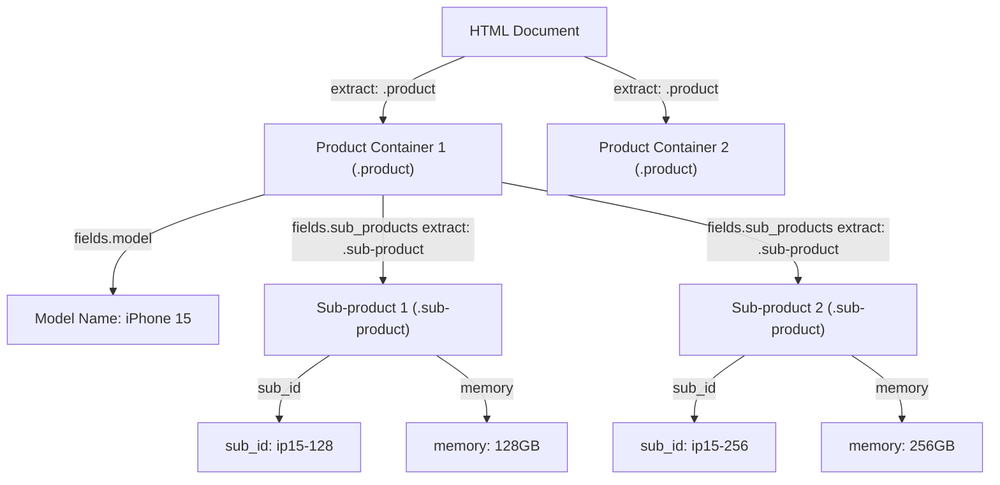

# Extraction and Selectors

## Overview

FetchFlow parses HTML responses using `lxml` and supports both **CSS selectors** and **XPath expressions**.

Extraction occurs in two distinct stages:
1. **Container Extraction (`extract`)**: Identifies repeating HTML block/container elements on a page (e.g. product cards).
2. **Field Extraction (`fields`)**: Extracts specific text or attribute values within each container element.

---

## HTML Structural Example & Extraction Scope

Consider the following HTML document:

```html
<div class="item-card">
  <h2 class="title">Item 1</h2>
</div>
<div class="item-card">
  <h2 class="title">Item 2</h2>
  <h2>Another title</h2>
</div>
<h2 class="title">Sub section</h2>
```

### Understanding `extract` vs `fields`

If you specify `extract` with selector `.item-card`:
- FetchFlow scopes extraction strictly to elements inside each `<div class="item-card">`.
- The standalone `<h2 class="title">Sub section</h2>` is ignored because it is outside `.item-card`.
- Inside the second `.item-card`, `<h2>Another title</h2>` does not match `h2.title`, so only `Item 2` is extracted for `title`.

**JSON Configuration for this HTML:**

```json
{
  "id": "items_step",
  "request": {
    "url": "https://example.com/catalog"
  },
  "extract": {
    "selector": ".item-card",
    "selector_type": "css"
  },
  "fields": {
    "item_title": {
      "selector": "h2.title",
      "selector_type": "css",
      "type": "text"
    }
  }
}
```

**Result Output:**

```json
[
  { "item_title": "Item 1" },
  { "item_title": "Item 2" }
]
```

---

## Nested Field Extractions (Same-Page Nested Loops)

When HTML containers contain nested sub-containers (e.g., product items that contain multiple sub-product options or memory variants), you can define a nested `fields` extraction block inside a parent field definition.

### Same-Page Nested Extraction Diagram



**JSON Configuration for Same-Page Nested Extraction:**

```json
{
  "id": "products_step",
  "request": {
    "url": "https://example.com/products"
  },
  "extract": {
    "selector": ".product"
  },
  "fields": {
    "model": {
      "selector": ".model-name",
      "type": "text"
    },
    "sub_products": {
      "extract": {
        "selector": ".sub-product",
        "selector_type": "css"
      },
      "fields": {
        "sub_id": {
          "selector": ".sub-id",
          "type": "text"
        },
        "capacity": {
          "selector": ".capacity",
          "type": "text"
        }
      }
    }
  }
}
```

---

## Field Extraction Properties

| Property | Type | Default | Description |
| --- | --- | --- | --- |
| `selector` | string | *Required* | CSS selector or XPath query relative to the container element. |
| `selector_type` | string | `"css"` | `"css"` or `"xpath"`. |
| `type` | string | `"text"` | `"text"` to extract element text, or `"attribute"` for an HTML attribute value. |
| `attribute` | string | Required if `type="attribute"` | Name of the HTML attribute to extract (e.g. `"href"`, `"data-id"`). |
| `transform` | array | `[]` | Pipeline of transformations to apply to extracted value(s). |
| `extract` | object | Optional | Sub-container extraction selector for nested fields. |
| `fields` | object | Optional | Map of sub-fields to extract recursively within each sub-container. |

---

## Selector Types: CSS vs XPath

### CSS Selectors
Use standard CSS selector syntax:
```json
"title": {
  "selector": "h2.title",
  "selector_type": "css",
  "type": "text"
}
```

### XPath Queries
Use XPath expressions for advanced selection (e.g. attributes or sub-tree queries):
```json
"link": {
  "selector": ".//a/@href",
  "selector_type": "xpath",
  "type": "attribute",
  "attribute": "href"
}
```

---

## Selecting Specific Elements by Position (e.g., 3rd Element)

To select a specific element by its index or position in a list (such as selecting the 3rd item), you can specify positional expressions directly in your CSS selectors or XPath queries:

### Using CSS Selectors (`:nth-child` / `:nth-of-type`)

Use the CSS pseudo-classes `:nth-child(n)` or `:nth-of-type(n)` to select the $n$-th element (1-based index):

```json
"third_item": {
  "selector": "ul.items > li:nth-child(3)",
  "selector_type": "css",
  "type": "text"
}
```

or using `:nth-of-type(3)`:

```json
"third_paragraph": {
  "selector": "div.content > p:nth-of-type(3)",
  "selector_type": "css",
  "type": "text"
}
```

### Using XPath Indexing (`[n]`)

Use 1-based numerical predicates in XPath expressions to target specific nodes:

```json
"third_item": {
  "selector": "//ul[@class='items']/li[3]",
  "selector_type": "xpath",
  "type": "text"
}
```

---

**Next:** Learn about the [Transformations Pipeline](transformations.md).
