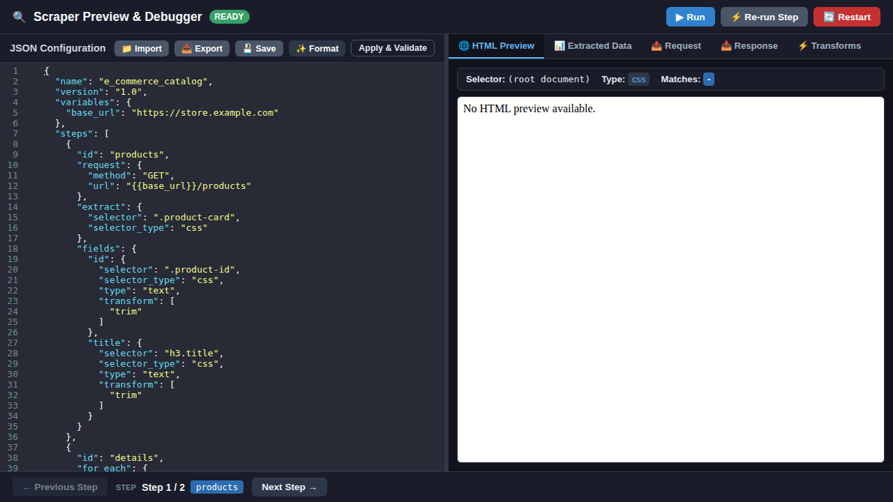

# Scraper Preview & Debugger

The **Scraper Preview & Debugger** is an interactive web tool for developing, testing, and debugging scraper configurations.

Thanks to its two-panel interface, you can edit your JSON scraper configuration on the left and preview execution results in real time on the right.



---

## How to Start

Ensure dependencies are installed and run:

```bash
python -m preview [config.json] [--host HOST] [--port PORT]
```

Access the debugger at `http://127.0.0.1:8000`.

---

## Main Features

- **Real-Time Two-Panel Interface**: Edit JSON configuration on the left while previewing sandboxed HTML highlights, extracted data, HTTP request/response details, and transform pipelines in real time on the right.
- **Configuration Management**: Import, export, format, validate, and save scraper configurations directly from the editor toolbar.
- **Schema-Driven Validation & Autocompletion**: Integrated with `SCRAPER_CONFIG_SCHEMA` (JSON Schema Draft-07 from `jexflow/config/validator.py`) via the `/api/config/schema` endpoint. CodeMirror provides real-time schema validation with exact error line navigation and autocompletion for JSON properties, selector types, condition operators, and HTTP methods.
- **Interactive Step Navigation**: Step forward/backward through workflow steps and `for_each` loop iterations with cached execution state.
