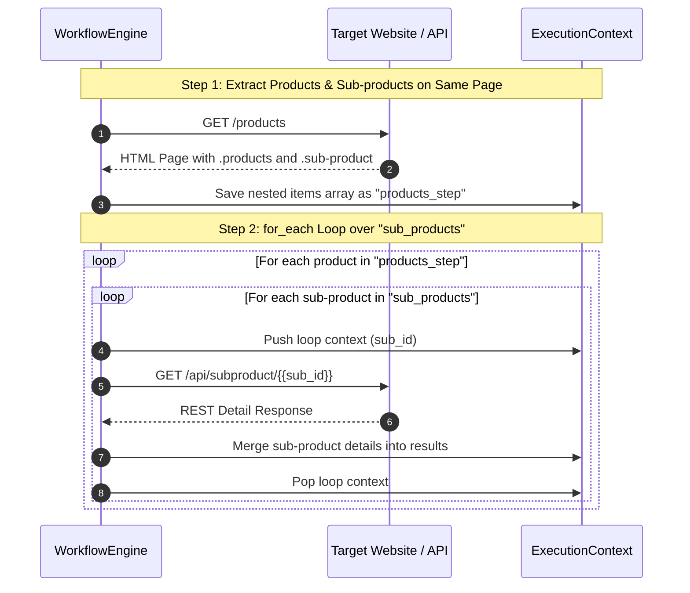

# Workflows and Loops

## Sequential Execution & Scope

Steps in Jexflow execute sequentially. Output from each step is stored under its `id` and can be passed to subsequent steps.

---

## Nested Loops on the Same Page

Jexflow supports extracting nested loops on the same page. For example, when inspecting a page containing multiple product cards (`.products`), each product might contain nested sub-products or options (`.sub-product`, memory capacities, variants, etc.).

You can extract nested structures by defining a field containing its own `fields` (and optional `extract` or `selector`):

```json
{
  "id": "products_step",
  "request": {
    "url": "https://example.com/products"
  },
  "extract": {
    "selector": ".product",
    "selector_type": "css"
  },
  "fields": {
    "product_name": {
      "selector": ".product-title",
      "type": "text"
    },
    "sub_products": {
      "extract": {
        "selector": ".sub-product",
        "selector_type": "css"
      },
      "fields": {
        "sub_id": {
          "selector": ".sub-id",
          "type": "text"
        },
        "capacity": {
          "selector": ".memory-capacity",
          "type": "text"
        }
      }
    }
  }
}
```

---

## `for_each` Loops

To perform multi-step web scraping (e.g., fetching a list of items or nested sub-items first, and then visiting each item URL or REST endpoint to extract detailed info), use the `for_each` construct inside a step.

### `for_each` Schema & Properties

| Property | Type | Required | Description |
| --- | --- | --- | --- |
| `from` | string | **Yes** | The `id` of a previous step whose extracted items array should be iterated over. |
| `field` | string | No | Specific field or dot-separated path (e.g. `sub_products` or `sub_products.sub_id`) from each item in the referenced step to iterate over or expose in the current step template. |
| `sub_field` | string | No | Optional key name to extract from nested dictionary items when exposing as `{{value}}`. |

When iterating over step results:
- If `field` references a list field (such as a nested array of sub-products), `for_each` iterates through every sub-item for each parent item.
- All fields from parent items and sub-item objects are exposed as template variables (e.g. `{{product_name}}`, `{{sub_id}}`, `{{value}}`).
- In the final workflow result, the extracted fields from the loop step are automatically merged with the fields from the item and sub-item being iterated over.

---

## Nested Loop Sequence Diagram

The following sequence diagram illustrates how same-page nested loops work in combination with a `for_each` REST call:



---

## Complete Nested Loop Example

Below is a complete workflow example. Step 1 loops on `.products` and for each product loops on `.sub-product` to extract `sub_id`. Step 2 uses `for_each` to issue a GET REST request for each phone sub-product ID:

```json
{
  "name": "nested_products_scraper",
  "variables": {
    "base_url": "https://example.com"
  },
  "steps": [
    {
      "id": "products_step",
      "request": {
        "method": "GET",
        "url": "{{base_url}}/phones"
      },
      "extract": {
        "selector": ".products"
      },
      "fields": {
        "phone_model": {
          "selector": ".model-name",
          "type": "text"
        },
        "sub_products": {
          "extract": {
            "selector": ".sub-product"
          },
          "fields": {
            "sub_id": {
              "selector": ".sub-id",
              "type": "text"
            },
            "capacity": {
              "selector": ".memory-capacity",
              "type": "text"
            }
          }
        }
      }
    },
    {
      "id": "sub_product_details",
      "for_each": {
        "from": "products_step",
        "field": "sub_products"
      },
      "request": {
        "method": "GET",
        "url": "{{base_url}}/api/subproduct/{{sub_id}}"
      },
      "extract": {
        "selector": ".details-card"
      },
      "fields": {
        "price": {
          "selector": ".price",
          "type": "text",
          "transform": ["trim"]
        },
        "stock": {
          "selector": ".stock-status",
          "type": "text"
        }
      }
    }
  ]
}
```

---

**Next:** Return to the [Wiki Overview](INDEX.md).
