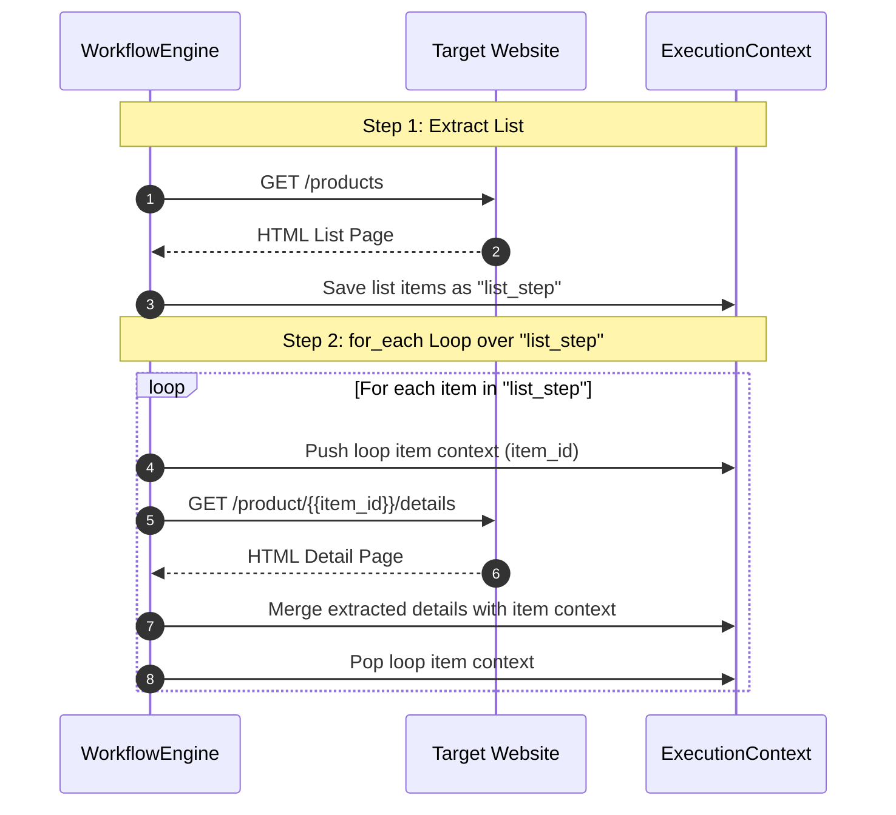

# Workflows and Loops

## Sequential Execution & Scope

Steps in FetchFlow execute sequentially. Output from each step is stored under its `id` and can be passed to subsequent steps.

---

## `for_each` Sequence Diagram

The following sequence diagram illustrates how a two-step workflow with a `for_each` loop operates:



---

## Workflow Loop Example

```json
{
  "name": "multi_step_scraper",
  "variables": {
    "base_url": "https://example.com"
  },
  "steps": [
    {
      "id": "list_step",
      "request": {
        "method": "GET",
        "url": "{{base_url}}/products"
      },
      "extract": {
        "selector": ".product-item"
      },
      "fields": {
        "item_id": {
          "selector": ".id-tag",
          "type": "text",
          "transform": ["trim"]
        }
      }
    },
    {
      "id": "detail_step",
      "for_each": {
        "from": "list_step",
        "field": "item_id"
      },
      "request": {
        "method": "GET",
        "url": "{{base_url}}/product/{{value}}/details"
      },
      "extract": {
        "selector": ".details-card"
      },
      "fields": {
        "price": {
          "selector": ".price",
          "type": "text",
          "transform": ["trim"]
        }
      }
    }
  ]
}
```

---

**Next:** Return to the [Wiki Overview](INDEX.md).
